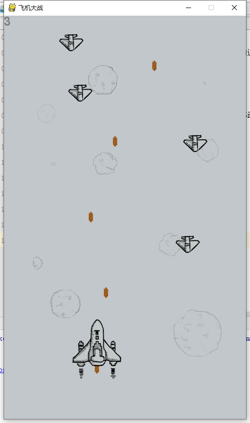
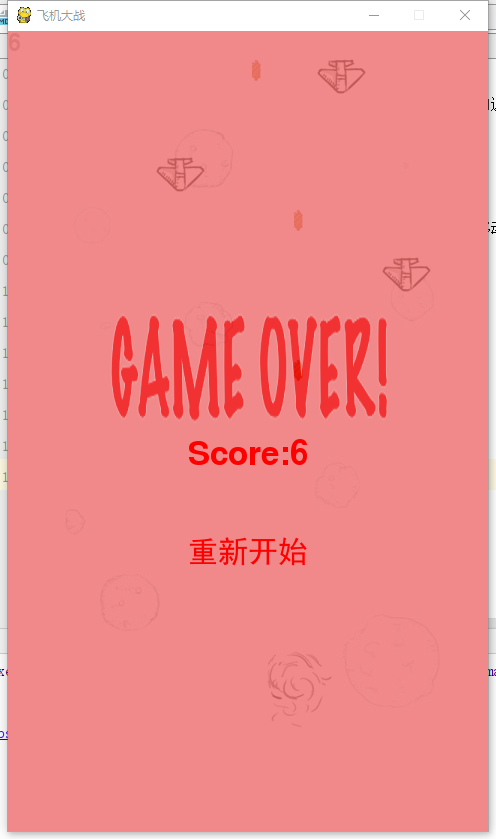

# 飞机大战 Python
## 1. 代码的整体框架
飞机大战主要涉及飞机、子弹、敌机和他们之间的逻辑判断等问题。

本此实验变成主要借助pygame库的框架进行游戏的搭建，主要包括类的定义和游戏循环判断。

本游戏主要涉及飞机、子弹、敌机三类对象，需要创建相关类和对于的方法。

编程中共设计了Bullet、Player和Enemy三个类，并完成其移动等方法。
## 2. 使用到的类及函数
### 2.1 Bullet类
Bullet类主要完成飞机设计的任务，程序中不单独进行实例化，在Player类中的shoot函数中进行实例化。
```python
class Bullet(pygame.sprite.Sprite):
    def __init__(self, bullet_img, init_pos):

        pygame.sprite.Sprite.__init__(self)
        self.image = bullet_img
        self.rect = self.image.get_rect()
        self.rect.midbottom = init_pos
        self.speed = 10

    def move(self):
        self.rect.top -= self.speed
```
- 初始化参数
    - bullet_img: 子弹的图片
    - init_pos: 子弹的位置状态
- move函数：按照设定的速度speed向上移动。
### 2.2 Player类
```
class Player(pygame.sprite.Sprite):
    def __init__(self, plane_img, player_rect, init_pos):
        pygame.sprite.Sprite.__init__(self)
        self.image = []
        for i in range(len(player_rect)):
            self.image.append(plane_img.subsurface(player_rect[i]).convert_alpha())
        self.rect = player_rect[0]
        self.rect.topleft = init_pos
        self.bullets = pygame.sprite.Group()
        self.image_index = 0
        self.speed = 6
        self.is_hit = False

    def shoot(self, bullet_img):
        bullet = Bullet(bullet_img, self.rect.midbottom)
        self.bullets.add(bullet)

    def moveUp(self):
        if self.rect.top <= 0:
            self.rect.top = 0
        else:
            self.rect.top -= self.speed

    def moveDown(self):
        if self.rect.top >= SCREEN_HEIGHT - self.rect.height:
            self.rect.top = SCREEN_HEIGHT - self.rect.height
        else:
            self.rect.top += self.speed

    def moveLeft(self):
        if self.rect.left <= 0:
            self.rect.left = 0
        else:
            self.rect.left -= self.speed

    def moveRight(self):
        if self.rect.left >= SCREEN_WIDTH - self.rect.width:
            self.rect.left = SCREEN_WIDTH - self.rect.width
        else:
            self.rect.left += self.speed
```
- 初始化参数：
    - plane_img： 图片，包含多张形成动画效果；
    - player_rect：飞机的图片在图片中位置
    - init_pos：飞机初始的位置状态
- 移动函数：按照设定的速度speed移动，但是飞机图片不得出画面。
    - moveUp：向上移动
    - moveDown：向下移动
    - moveLeft：向左移动
    - moveRight：向右移动
### 2.3 Enemy类
```
class Enemy(pygame.sprite.Sprite):
    def __init__(self, enemy_img, enemy_down_imgs, init_pos):
        pygame.sprite.Sprite.__init__(self)
        self.image = enemy_img
        self.rect = self.image.get_rect()
        self.rect.topleft = init_pos
        self.down_imgs = enemy_down_imgs
        self.speed = 2
        self.down_index = 0

    def move(self):
        self.rect.top += self.speed
```
- 初始化参数
    - enemy_img: 敌机的图片
    - enemy_down_imgs：敌机坠毁的图片
    - init_pos:敌机的位置状态
- move函数：按照设定的速度speed向下移动。
### 2.4 startGame函数
游戏中完成类的设计后，需要完成对象的创建，飞机大战的逻辑主要包括以下部分：
- 完成player、bullet和enemy实例化对象的创建；
- 游戏开始时，玩家出现在游戏最下方的中间；
- 飞机以一定的频率进行射击，发射子弹，向上移动；
- 敌机以一定的频率随机从最上方，随机位置出现，向下移动
- 子弹与敌机碰撞，敌机被移除，并得分；
- 敌机与玩家相撞，玩家死亡
- 玩家失败，游戏结束；
- 显示得分和结束页面，并显示重新开始按钮。
## 3. 整理代码实现过程中遇到的问题

本游戏虽然能流程运行，但是游戏运行中后出现报错的情况。主要错误如下：
```
libpng warning: iCCP: known incorrect sRGB profile
libpng warning: iCCP: cHRM chunk does not match sRGB
```
查询资料可知，该错误为警告，不影响程序的正确运行，可以使用以下代码进行忽略：
```
import warnings
warnings.filterwarnings('ignore')
```
## 4. 实验截图
### 4.1 飞机大杂运行截图
- 左上角为得分
- 键盘w s a d或上下左右控制飞机的移动


### 4.2 游戏结束截图
结束页面的内容以此为：
- 显示得分；
- 重新开始按钮，点击重新开始游戏

